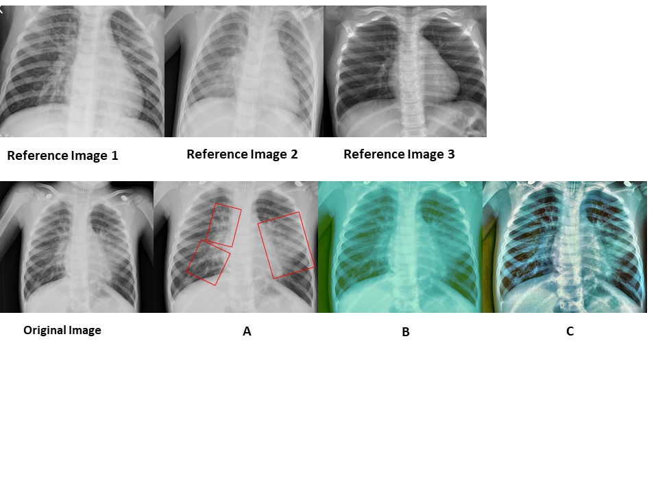
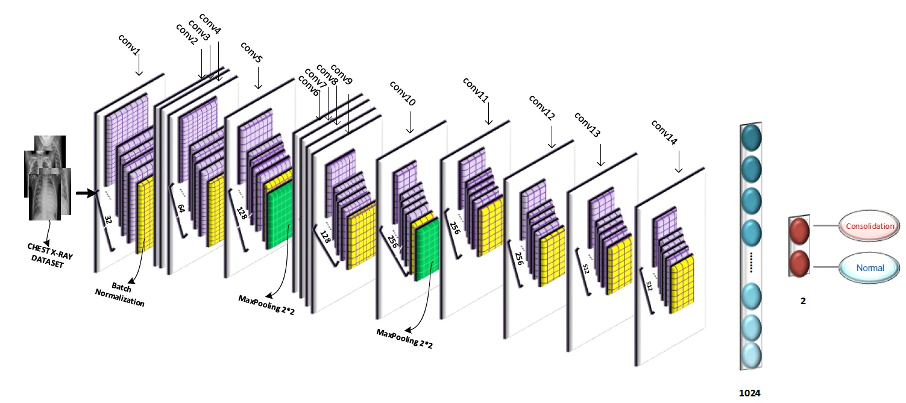

# detection-of-consolidation-on-chest-X-ray-images-using-problem-based-CNN-architectures
• ChestNet is proposed which is proportional to the size of the dataset for detecting consolidation in chest X-ray images.

• ChestNet has two times fewer max-pooling layers than the VGG16 and DenseNet121 to preserves the features of the images.

• An efficient pre-processing process is proposed to remove confounding variables and histogram difference between images.

• An extra validation with a totally different dataset is performed to indicate the generality of the proposed model.

See the paper: https://www.sciencedirect.com/science/article/abs/pii/S0169260719306960

The Output of pre-processing phase:

Three reference images were shown in the above of figure. The reference image 1 and 2 are the images including consolidation and reference image 3 is a normal image. Also, the outputs of each pre-processing step were shown in the down side of figure. The rectangles show the regions of consolidation.

The proposed Architecture:

